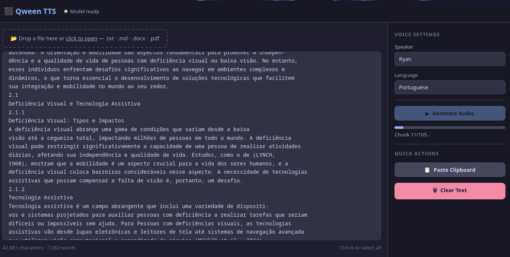

# Qween TTS

[](https://www.python.org/)
[](https://flask.palletsprojects.com/)
[](https://docs.python.org/3/library/tkinter.html)
[](LICENSE)

Text-to-speech (TTS) app with multiple backends (Qwen3-TTS, Piper, Coqui), with both a Flask web UI and a Tkinter desktop UI. It can read documents and generate WAV audio from text.




## Features

- Web UI with file upload and progress tracking.
- Desktop UI with editor, word count, and playback.
- Multiple languages and preset speakers (backend dependent).
- Reads .txt, .md, .docx, and .pdf.
- Background generation with WAV download.

## Structure

- [app.py](app.py): Flask server and API.
- [gui.py](gui.py): Tkinter desktop app.
- [tts_engine.py](tts_engine.py): multi-backend engine, chunking, and WAV writing.
- [document_reader.py](document_reader.py): document text extraction.
- [templates/index.html](templates/index.html): web UI.
- [test_tts.py](test_tts.py): quick model test.
- [requirements.txt](requirements.txt): Python dependencies.

## Requirements

- Python 3.10+ (3.11 recommended for Coqui).
- CUDA GPU for best performance (optional).
- GPU drivers installed (CUDA recommended).

## Installation

Create and activate a Python environment, then install dependencies:

```bash
pip install -r requirements.txt
```

Note: For best GPU support, you may want to reinstall PyTorch with a CUDA wheel that matches your driver/toolkit version after running the install below.

## GPU setup (recommended)

If you have CUDA drivers installed, install a CUDA-enabled PyTorch build after the base requirements:

```bash
pip install -r requirements.txt
pip install --upgrade --index-url https://download.pytorch.org/whl/cu124 torch==2.11.0
```

If you prefer conda:

```bash
conda create -n abil python=3.11
conda activate abil
conda install -c pytorch -c nvidia pytorch pytorch-cuda=12.4
pip install -r requirements.txt
```

## Run

### Web (Flask)

```bash
python app.py
```

Open http://localhost:5050 in your browser.

### Desktop (Tkinter)

```bash
python gui.py
```

### Quick model test

```bash
python test_tts.py
```

The file `output.wav` will be created in the current directory.

## Supported formats

- `.txt`
- `.md` / `.markdown`
- `.docx`
- `.pdf`

## Notes

- Web-generated audio files are stored in `outputs/`.
- The web UI loads the model in the background and reports readiness.
- On CPU, loading can be slower. Adjust the device in the UI if needed.

## Sample audio (inline player)

<audio controls>
	<source src="output.wav" type="audio/wav" />
	Your browser does not support the audio element.
</audio>

<audio controls>
	<source src="outputs/b8782662fc6943328b834853701f208a.wav" type="audio/wav" />
	Your browser does not support the audio element.
</audio>

## Backend configuration

### Qwen3-TTS

Default backend. Uses `qwen-tts` and `torch` for GPU execution.

### Piper

Set the model path before running:

```bash
export PIPER_MODEL=/path/to/model.onnx
export PIPER_CONFIG=/path/to/model.onnx.json
```

Optional extra CLI args:

```bash
export PIPER_ARGS="--use_cuda"
```

### Coqui TTS

Set the model name (or use the default):

```bash
export COQUI_MODEL=tts_models/en/ljspeech/tacotron2-DDC
```

### Backend and device selection

```bash
export TTS_BACKEND=qwen   # qwen | piper | coqui
export TTS_DEVICE=cuda:0  # cuda:0 | cuda:1 | cpu
```
